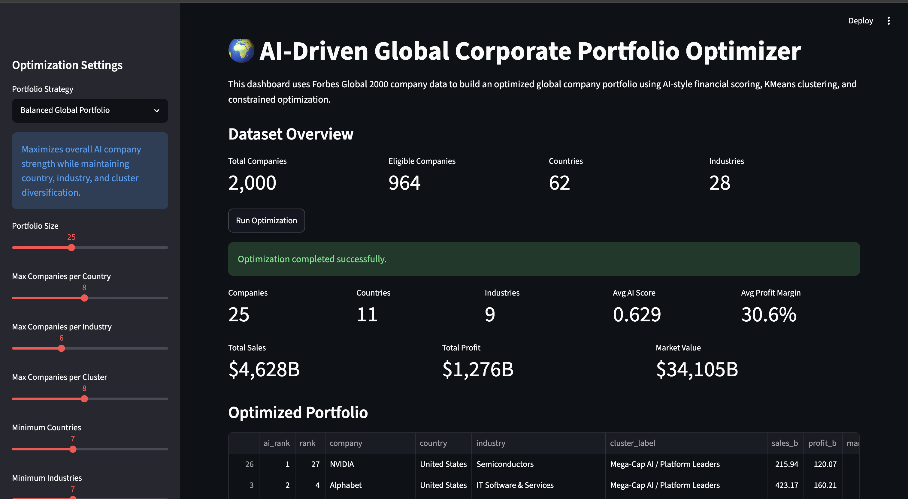
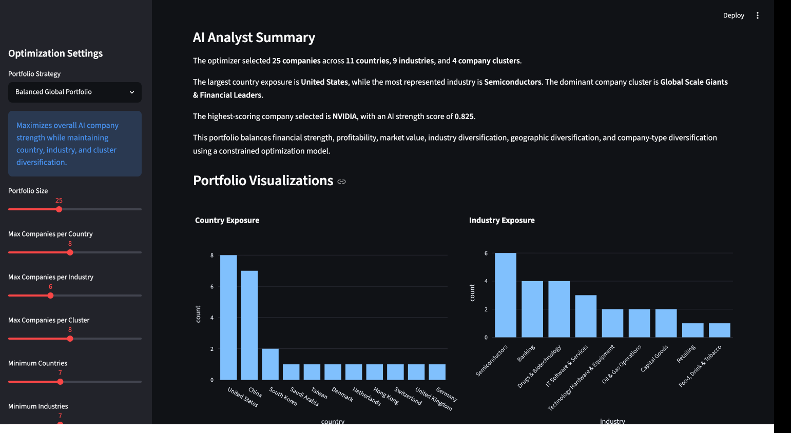
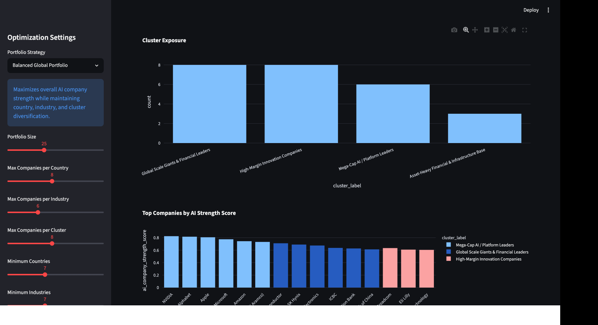

# AI-Driven Global Corporate Portfolio Optimizer

An AI and optimization project that uses the Forbes Global 2000 Companies 2026 dataset to build globally diversified corporate portfolios.

This project combines financial feature engineering, AI-style company scoring, machine learning clustering, constrained optimization, and an interactive Streamlit dashboard. The goal is to move beyond simple company rankings and build a decision system that selects companies under real-world diversification constraints.

---

## Project Objective

The main question behind this project is:

> Given the world's largest public companies, can we use AI-driven scoring and optimization to construct a globally diversified portfolio that balances financial strength, profitability, market value, industry exposure, country exposure, and company-type exposure?

Instead of simply selecting the top-ranked companies, this project builds a complete decision pipeline that:

* Scores companies using custom financial intelligence features
* Groups companies into strategic clusters using machine learning
* Selects an optimized portfolio using constrained optimization
* Allows users to test different portfolio strategies through a dashboard

---

## Why This Project Matters

Traditional company rankings are useful, but they do not directly answer decision-making questions such as:

* Which companies should be selected under diversification constraints?
* How should exposure be balanced across countries and industries?
* How can we avoid over-concentration in mega-cap technology companies?
* Which companies are financially strong but strategically different from each other?
* How can machine learning and optimization work together for portfolio construction?

This project addresses those questions by combining:

* Business analytics
* Financial analytics
* Machine learning
* Operations research
* Optimization modeling
* Interactive decision support

---

## Dataset

The project uses the Forbes Global 2000 Companies 2026 dataset from Kaggle.

The dataset contains 2,000 public companies with the following fields:

| Column            | Description                         |
| ----------------- | ----------------------------------- |
| Rank              | Forbes Global 2000 rank             |
| Company           | Company name                        |
| Headquarters      | Company headquarters location       |
| Industry          | Company industry                    |
| Sales ($B)        | Sales in billions of dollars        |
| Profit ($B)       | Profit in billions of dollars       |
| Assets ($B)       | Assets in billions of dollars       |
| Market Value ($B) | Market value in billions of dollars |

---

## Project Pipeline

The project is built in six main stages:

1. Data cleaning
2. Financial feature engineering
3. AI company strength scoring
4. Machine learning clustering
5. Constrained portfolio optimization
6. Interactive Streamlit dashboard

---

## 1. Data Cleaning

The original dataset was cleaned and standardized by:

* Renaming columns into Python-friendly names
* Extracting the true country from the headquarters field
* Handling missing industry values
* Handling missing market value values
* Replacing infinite values created by financial ratios
* Preparing the dataset for scoring, clustering, and optimization

Example cleaned columns:

```text
rank
company
headquarters
country
industry
sales_b
profit_b
assets_b
market_value_b
```

---

## 2. Financial Feature Engineering

The project creates additional financial ratios to evaluate company quality and efficiency.

### Engineered Features

| Feature          | Formula               | Meaning                                             |
| ---------------- | --------------------- | --------------------------------------------------- |
| Profit Margin    | Profit / Sales        | Measures how much profit a company keeps from sales |
| Return on Assets | Profit / Assets       | Measures how efficiently assets generate profit     |
| Asset Turnover   | Sales / Assets        | Measures how efficiently assets generate revenue    |
| Market-to-Sales  | Market Value / Sales  | Measures valuation relative to revenue              |
| Market-to-Profit | Market Value / Profit | Measures valuation relative to profit               |

These features allow the model to evaluate companies beyond their raw Forbes rank.

---

## 3. AI Company Strength Score

A custom AI-style company strength score is created using normalized financial metrics.

The score considers:

* Sales
* Profit
* Assets
* Market value
* Profit margin
* Return on assets
* Asset turnover
* Market-to-sales ratio

The scoring system uses log transformations and outlier clipping to reduce distortion from extremely large companies or unusual ratio values.

### Scoring Logic

The AI Company Strength Score is designed to reward companies that combine:

* Large scale
* Strong profitability
* High market value
* Efficient use of assets
* Healthy margins
* Strong business fundamentals

This creates a custom ranking that can be compared against the original Forbes ranking.

---

## 4. Machine Learning Clustering

KMeans clustering is used to group companies into strategic company types.

The clustering model uses financial and scoring features such as:

* Sales
* Profit
* Assets
* Market value
* Profit margin
* Return on assets
* Asset turnover
* Market-to-sales
* AI company strength score

PCA is used to visualize the clusters in two dimensions.

### Cluster Labels

The companies are grouped into the following strategic clusters:

| Cluster Label                                 | Description                                                                            |
| --------------------------------------------- | -------------------------------------------------------------------------------------- |
| Mega-Cap AI / Platform Leaders                | Dominant global platforms and AI-driven mega-cap companies                             |
| Global Scale Giants & Financial Leaders       | Large global banks, technology leaders, and scale-driven companies                     |
| High-Margin Innovation Companies              | High-margin technology, semiconductor, biotechnology, and payment companies            |
| Operating Scale / Consumer & Industrial Firms | Large operating businesses in retail, transportation, consumer, and industrial sectors |
| Asset-Heavy Financial & Infrastructure Base   | Banks, insurers, utilities, capital goods, and infrastructure-heavy firms              |

This clustering layer gives the project a real machine learning component and helps the optimizer diversify across company types.

---

## 5. Constrained Optimization Model

The optimization model selects a portfolio of companies by maximizing a chosen score while enforcing diversification and quality constraints.

The model uses binary decision variables:

```text
x_i = 1 if company i is selected
x_i = 0 otherwise
```

### Objective Function

The base objective is:

```text
Maximize total portfolio score
```

The portfolio score can be based on:

* AI Company Strength Score
* Scenario-specific score
* Innovation score
* Defensive quality score
* High-profit-margin score
* Non-US diversification score

### Constraints

The optimizer supports constraints such as:

* Select a fixed number of companies
* Limit maximum companies from one country
* Limit maximum companies from one industry
* Limit maximum companies from one company cluster
* Require a minimum number of countries
* Require a minimum number of industries
* Require a minimum number of company clusters
* Exclude companies with negative profit
* Exclude very small companies with distorted ratios
* Exclude extreme financial outliers

This makes the project a practical operations research application.

---

## 6. Scenario Optimization

The dashboard supports multiple portfolio strategies.

### Available Strategies

| Strategy                     | Description                                                                                   |
| ---------------------------- | --------------------------------------------------------------------------------------------- |
| Balanced Global Portfolio    | Maximizes overall AI company strength while maintaining diversification                       |
| AI & Innovation Portfolio    | Prioritizes semiconductors, software, biotechnology, AI platforms, and high-margin innovators |
| Defensive Quality Portfolio  | Prioritizes profitable, stable, high-margin companies with strong market value                |
| High-Profit Margin Portfolio | Prioritizes companies with strong profitability and efficient business models                 |
| Non-US Diversified Portfolio | Reduces dependence on the United States and highlights global companies outside the US        |

Each strategy modifies the objective function while using the same optimization framework.

---

## Current Optimized Portfolio Result

Using the balanced optimization setup, the model selected 25 companies across multiple countries, industries, and machine learning-derived company clusters.

### Portfolio Summary

| Metric                       |       Value |
| ---------------------------- | ----------: |
| Companies Selected           |          25 |
| Countries Represented        |          11 |
| Industries Represented       |           9 |
| Company Clusters Represented |           4 |
| Average AI Score             |      0.6294 |
| Total Sales                  |  $4,627.59B |
| Total Profit                 |  $1,275.70B |
| Total Market Value           | $34,105.23B |
| Average Profit Margin        |      30.63% |

### Country Exposure

| Country        | Companies |
| -------------- | --------: |
| United States  |         8 |
| China          |         7 |
| South Korea    |         2 |
| Saudi Arabia   |         1 |
| Taiwan         |         1 |
| Denmark        |         1 |
| Netherlands    |         1 |
| Hong Kong      |         1 |
| Switzerland    |         1 |
| United Kingdom |         1 |
| Germany        |         1 |

### Industry Exposure

| Industry                        | Companies |
| ------------------------------- | --------: |
| Semiconductors                  |         6 |
| Banking                         |         4 |
| Drugs & Biotechnology           |         4 |
| IT Software & Services          |         3 |
| Technology Hardware & Equipment |         2 |
| Oil & Gas Operations            |         2 |
| Capital Goods                   |         2 |
| Retailing                       |         1 |
| Food, Drink & Tobacco           |         1 |

### Cluster Exposure

| Cluster                                     | Companies |
| ------------------------------------------- | --------: |
| Global Scale Giants & Financial Leaders     |         8 |
| High-Margin Innovation Companies            |         8 |
| Mega-Cap AI / Platform Leaders              |         6 |
| Asset-Heavy Financial & Infrastructure Base |         3 |

---

## Example Companies Selected

The optimized portfolio includes companies such as:

* NVIDIA
* Alphabet
* Apple
* Microsoft
* Amazon
* Saudi Aramco
* Taiwan Semiconductor
* SK Hynix
* Samsung Electronics
* ICBC
* Broadcom
* Eli Lilly
* Tencent Holdings
* Novo Nordisk
* ASML Holding
* AstraZeneca
* Siemens

These companies were selected because they scored strongly while helping satisfy diversification constraints across countries, industries, and company clusters.

---

## Dashboard

The project includes an interactive Streamlit dashboard.

The dashboard allows users to configure:

* Portfolio size
* Maximum companies per country
* Maximum companies per industry
* Maximum companies per cluster
* Minimum number of countries
* Minimum number of industries
* Minimum number of clusters
* Portfolio strategy

The dashboard returns:

* Optimized portfolio table
* AI analyst summary
* Country exposure chart
* Industry exposure chart
* Cluster exposure chart
* Top company score chart
* Downloadable optimized portfolio CSV

---


---

## Dashboard Demo

### Dashboard Overview



### Optimized Portfolio View



### Portfolio Charts




## Visual Outputs

The project generates the following visualizations:

* Country exposure chart
* Industry exposure chart
* Cluster exposure chart
* Top companies by AI score chart
* PCA company cluster chart

Generated charts are saved in:

```text
outputs/charts/
```

---

## Project Structure

```text
global-corporate-ai-optimizer/
│
├── app/
│   └── streamlit_app.py
│
├── data/
│   ├── forbes_global_2000_2026.csv
│   ├── forbes_global_2000_2026_features.csv
│   ├── forbes_global_2000_2026_scored.csv
│   └── forbes_global_2000_2026_clustered.csv
│
├── outputs/
│   ├── optimized_portfolio.csv
│   ├── portfolio_report.md
│   └── charts/
│       ├── country_exposure.png
│       ├── industry_exposure.png
│       ├── top_companies_ai_score.png
│       └── company_clusters_pca.png
│
├── src/
│   ├── check_data.py
│   ├── features.py
│   ├── scoring.py
│   ├── clustering.py
│   ├── optimizer.py
│   ├── scenarios.py
│   └── report.py
│
├── README.md
├── requirements.txt
└── .gitignore
```

---

## Installation

Clone the repository:

```bash
git clone <your-repository-url>
cd global-corporate-ai-optimizer
```

Create a virtual environment:

```bash
python3 -m venv .venv
source .venv/bin/activate
```

Install dependencies:

```bash
pip install -r requirements.txt
```

---

## How to Run the Full Pipeline

Run the following commands from the project root:

```bash
python src/features.py
python src/scoring.py
python src/clustering.py
python src/optimizer.py
python src/report.py
```

This will generate:

* Cleaned feature dataset
* Scored company dataset
* Clustered company dataset
* Optimized portfolio CSV
* Markdown report
* Portfolio charts

---

## How to Run the Dashboard

Launch the Streamlit app:

```bash
streamlit run app/streamlit_app.py
```

Then open the local URL shown in the terminal, usually:

```text
http://localhost:8501
```

To stop the app, press:

```text
Control + C
```

---

## Technologies Used

* Python
* Pandas
* NumPy
* Scikit-learn
* KMeans Clustering
* PCA
* PuLP
* CBC Optimizer
* Streamlit
* Plotly
* Matplotlib

---

## Key Files

| File                   | Purpose                                              |
| ---------------------- | ---------------------------------------------------- |
| `src/features.py`      | Cleans data and creates financial ratios             |
| `src/scoring.py`       | Builds the AI Company Strength Score                 |
| `src/clustering.py`    | Runs KMeans clustering and PCA visualization         |
| `src/optimizer.py`     | Builds and solves the constrained optimization model |
| `src/scenarios.py`     | Creates scenario-specific portfolio scores           |
| `src/report.py`        | Generates portfolio report and charts                |
| `app/streamlit_app.py` | Interactive dashboard                                |

---

## Skills Demonstrated

This project demonstrates:

* Data cleaning
* Feature engineering
* Financial ratio analysis
* Machine learning clustering
* PCA visualization
* Optimization modeling
* Constraint formulation
* Scenario analysis
* Dashboard development
* Business analytics storytelling
* AI-assisted decision system design

---

## Future Improvements

Potential extensions include:

* Add real stock market returns and volatility data
* Add risk-adjusted optimization
* Add sector-level concentration limits
* Add ESG or sustainability scoring
* Add Sharpe ratio or downside-risk constraints
* Add time-series backtesting
* Add Monte Carlo stress testing
* Add natural language portfolio explanations using an LLM
* Deploy the Streamlit app online
* Compare optimized portfolios against Forbes rank-only portfolios

---

## Project Takeaway

This project shows how AI and optimization can work together for decision-making.

Instead of simply ranking companies, the system creates an intelligent portfolio selection engine that balances financial quality, company scale, market value, and diversification constraints.

The result is a practical AI-driven decision support tool for global corporate portfolio construction.
